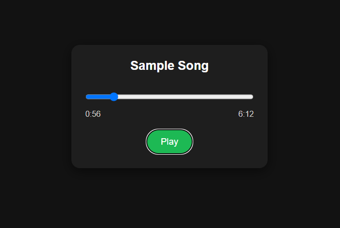

# Vanilla JS Music Player

A simple and responsive music player built using HTML, CSS, and JavaScript. The player streams audio from an online source and provides custom playback controls, progress tracking, and time display functionality using the HTML5 Audio API.

## Features

* Play and pause audio
* Progress bar with seeking support
* Current playback time display
* Total audio duration display
* Responsive design for mobile and tablet devices
* Audio streamed from an online URL

## Technologies Used

* HTML5
* CSS3
* JavaScript (Vanilla JS)
* HTML5 Audio API

## Project Structure

```text
vanilla-js-music-player/
│
├── index.html
├── style.css
├── script.js
├── screenshot.png
└── README.md
```

## Screenshot



## How It Works

* The HTML5 `<audio>` element is used to load and play audio from an online source.
* JavaScript handles playback controls and updates the user interface.
* The progress bar reflects the current playback position.
* Users can drag the progress bar to seek different parts of the track.
* Current time and total duration are formatted and displayed in minutes and seconds.

## Installation

1. Clone the repository:

```bash
git clone https://github.com/Areej39/vanilla-js-music-player.git
```

2. Navigate to the project directory:

```bash
cd vanilla-js-music-player
```

3. Open `index.html` in your browser.

## Learning Outcomes

Through this project, I practiced:

* DOM manipulation
* Event handling
* Working with the HTML5 Audio API
* Updating UI based on audio events
* Responsive web design with CSS media queries
* JavaScript time formatting and calculations

## Future Improvements

* Previous and next track controls
* Playlist support
* Volume control
* Shuffle and repeat modes
* Album artwork display
* Dynamic song information

## Author

GitHub: Areej39
